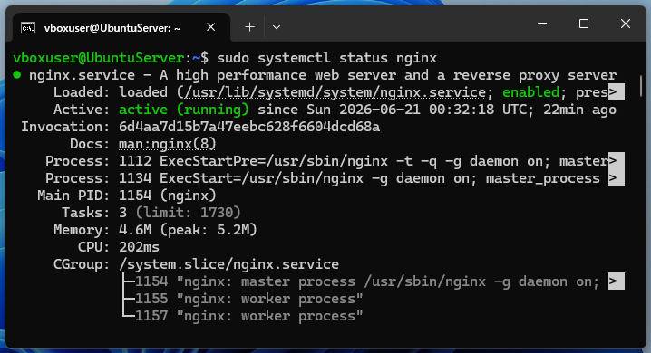
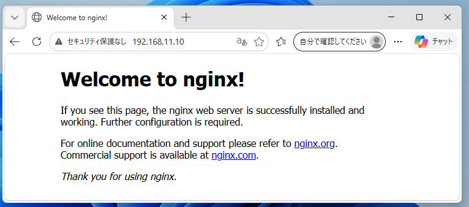
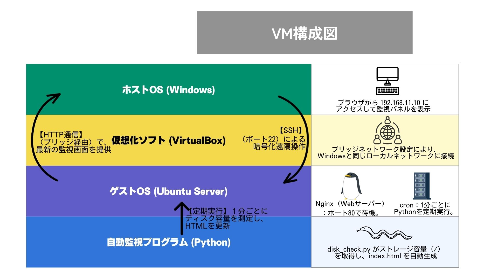

# VirtualBoxを用いたLinuxサーバ構築およびWebサーバ運用検証

本プロジェクトは、VirtualBox上にLinuxサーバを構築し、Webサーバ（Nginx）の導入および運用確認を行ったものです。  
また、Pythonによる簡易監視ツールを組み合わせた構成で、基盤SE業務（サーバ構築・運用・監視）の基礎工程を想定しています。

---

## 1. 要件定義
- Linux上にWebサーバを構築し、ホストOSからアクセス可能な環境を作成する
- サーバ状態を確認する簡易監視機能を実装する

---

## 2. 設計

### システム構成概要
本システムは以下の4層構成で設計されている。

###  ホストOS（Windows）
- PCおよびブラウザを使用
- `192.168.11.10` にアクセスし監視画面を表示
- SSHによるリモート操作を実施

---

###  仮想化基盤（VirtualBox）
- ブリッジネットワーク構成
- ホストOSと同一ネットワークに接続

---

###  ゲストOS（Ubuntu Server）
- Webサーバ：Nginx（ポート80）
- cronによる定期処理実行
- SSHによるリモート管理

---

###  監視プログラム（Python）
- `disk_check.py` によりディスク使用状況を取得
- `shutil` を使用してストレージ情報を収集
- 取得結果を `index.html` として出力

---

## 3. 構築
- Ubuntu Serverインストール
- Nginxインストールおよび起動確認
- Pythonスクリプト作成（disk_check.py）
- cron設定（定期実行）

---

## 4. テスト
- Nginx起動確認（systemctl status nginx）
- ブラウザアクセス確認（HTTP疎通）
- ディスク情報取得確認

---

## 5. 成果物
- Webサーバ公開画面（スクリーンショット）
- Nginx稼働状態（スクリーンショット）
- Python監視スクリプト（disk_check.py）
- VM構成図（アーキテクチャ図）

---

## 6. 検証エビデンス

### 6.1 Nginxサービス稼働確認
Ubuntuサーバ上でNginxが正常に起動していることを確認。

---

### 6.2 ブラウザ疎通確認
WindowsブラウザからUbuntuサーバへアクセスし、Webページが表示されることを確認。

---

## 7. システム構成図

本システムの構成は以下の通り。

---

## 8. データフロー概要

- Python（disk_check.py）がディスク情報を取得
- HTML（index.html）を生成
- NginxがWebとして公開
- WindowsブラウザがHTTP経由で閲覧
- SSHによりリモート操作可能
